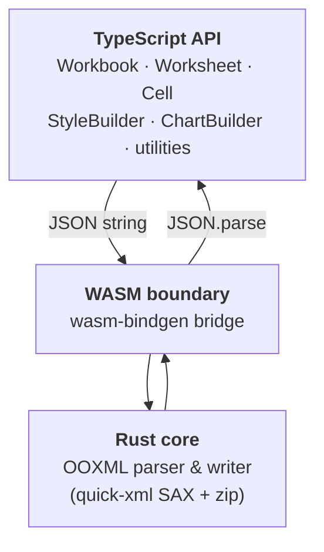

<div align="center">

# modern-xlsx

**High-performance XLSX read/write for JavaScript &amp; TypeScript, powered by Rust + WASM.**

<p>
  <a href="https://www.npmjs.com/package/modern-xlsx"></a>
  <a href="https://github.com/ABCrimson/modern-xlsx/actions/workflows/ci.yml"></a>
  <a href="https://github.com/ABCrimson/modern-xlsx/blob/master/packages/modern-xlsx/LICENSE"></a>
  
  
</p>

<p>
  <a href="./packages/modern-xlsx/README.md">API Docs</a> ·
  <a href="https://github.com/ABCrimson/modern-xlsx/wiki">Wiki</a> ·
  <a href="./docs/FEATURE-COMPARISON.md">Feature Comparison</a> ·
  <a href="./docs/examples.md">Examples</a> ·
  <a href="./packages/modern-xlsx/CHANGELOG.md">Changelog</a> ·
  <a href="https://abcrimson.github.io/modern-xlsx/playground.html">Playground</a>
</p>

</div>

---

Full cell styling, data validation, conditional formatting, frozen panes, hyperlinks, comments, sheet protection, and more — features that SheetJS locks behind a **paid Pro license** — all **free and open source**.

```typescript
import { initWasm, Workbook } from 'modern-xlsx';

await initWasm();

const wb = new Workbook();
const ws = wb.addSheet('Sheet1');
ws.cell('A1').value = 'Hello';
ws.cell('B1').value = 42;

const bold = wb.createStyle().font({ bold: true }).build(wb.styles);
ws.cell('A1').styleIndex = bold;

await wb.toFile('output.xlsx');
```

## Performance

Node.js 26, single thread, vs SheetJS (`xlsx` 0.20.3) — indicative, hardware-dependent:

| Operation | modern-xlsx | SheetJS CE | |
|-----------|------------:|-----------:|---:|
| **Read** (100K rows) | 494 ms | 2,072 ms | **4.2x faster** |
| **Read** (10K rows) | 52 ms | 177 ms | **3.4x faster** |
| **Write** (10K rows) | 180 ms | 159 ms | ~parity |
| **Output size** (100K rows) | ~5 MB | ~40 MB | **~8x smaller** |

The biggest wins are read speed (3-4x) and file size (~8x smaller); write throughput and CSV/JSON export are roughly at parity.

> Browser bundle ~78 KB minified (~24 KB gzip) + ~1.9 MB WASM (~650 KB gzip). Zero runtime dependencies.

## Install

```bash
npm install modern-xlsx
```

> [!NOTE]
> Full API documentation lives in **[packages/modern-xlsx/README.md](./packages/modern-xlsx/README.md)** (the npm package README) and the **[project wiki](https://github.com/ABCrimson/modern-xlsx/wiki)**.

## Repository Structure

```
crates/
  modern-xlsx-core/       Rust core — OOXML parsing, XML generation, ZIP I/O
  modern-xlsx-wasm/       WASM bridge — wasm-bindgen exports

packages/
  modern-xlsx/            npm package — TypeScript API, tests, benchmarks
```

### Architecture



Data crosses the WASM boundary as JSON strings for maximum throughput. The Rust core handles ZIP compression, SAX-style XML parsing, shared string table construction, and style resolution.

## Development

```bash
# Rust tests (441 tests)
cargo test -p modern-xlsx-core

# WASM build
cd crates/modern-xlsx-wasm && wasm-pack build --target web --release \
  --out-dir ../../packages/modern-xlsx/wasm --no-opt

# TypeScript build + tests (1290 tests)
pnpm -C packages/modern-xlsx build
pnpm -C packages/modern-xlsx test

# Lint
cargo clippy -p modern-xlsx-core -- -D warnings
pnpm -C packages/modern-xlsx lint
```

**Toolchain:** Rust 1.96 MSRV / beta channel toolchain, currently 1.99 (Edition 2024) / TypeScript 7.0 / Vitest 5 / pnpm 12 / Biome 2.5

## License

[MIT](./packages/modern-xlsx/LICENSE)
